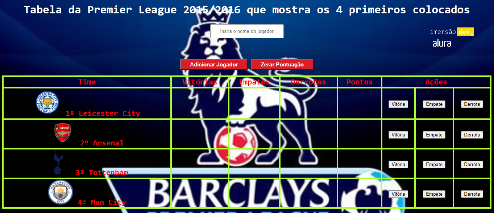

Desafio do sexto dia da Imersão Dev da Alura em que nessa aula, o desafio é fazer uma tabela de classificação para adicionar um jogador e zerar a pontuação dos jogadores. Foi aprendido o conceito de objetos em JavaScript, e com essa tabela foi possível colocar em prática como se deve usar objetos em JavaScript.

Tecnologias usadas: HTML5, CSS3 e JavaScript.

